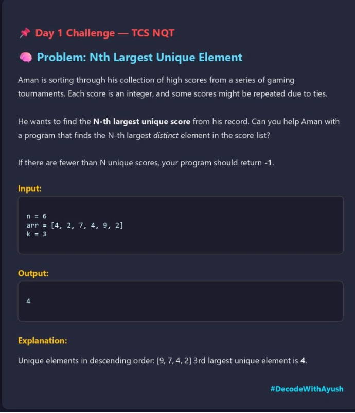
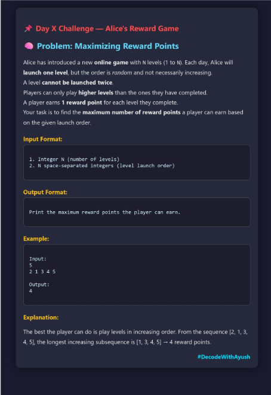

# DSA-Practice 

This repository contains my daily solutions for coding challenges as part of the **Decode With Ayush Challenge Series** aimed at preparing for real interview-level problems from companies like **TCS, Infosys, and more.**

---

## 🎯 Current Challenge: Decode With Ayush - Daily Technical Challenge Series
This challenge is focused on solving company-level coding questions regularly to help students, freshers, and job seekers improve problem-solving skills and get placement-ready.

- Challenge Organizer: [Ayush's LinkedIn](https://www.linkedin.com/in/ayush-gupta-7181b7241 )  
- Community WhatsApp Group: [Join Here](https://lnkd.in/dwwFKEvx)  
- Hashtag: **#DecodeWithAyush**

---

## Folder Structure
Each problem includes:
- Problem Screenshot (for quick reference)
- Solution Code

---

## How to Participate
1. Check the daily problem (posted by Ayush on LinkedIn)
2. Solve it in your preferred programming language
3. Post your solution on your LinkedIn feed
4. Use the hashtag **#DecodeWithAyush** to join the community stream
5. Tag Ayush to get your solution reviewed or featured

---

## 📚 Problems Solved

### Day 1 - TCS NQT
- 📸 
- 💻 [Solution in C++](./Day1_TCSNQT/nth_largest.cpp)
### Day 2 
- 
- [Solution in C++](./Day2/alice.cpp)
### Day 3
- 
- [Solution in java](./Day3/jnjTCS.java)
---

## Let’s Connect 🔥
I’m always happy to connect with fellow learners and coders!

- Follow me on GitHub to stay updated with my coding journey.
- Feel free to check out my other projects and repositories.

Let’s grow and decode together! 💪
